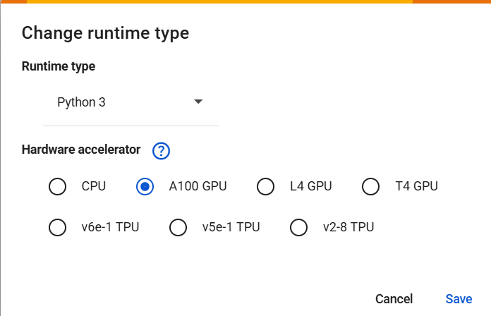
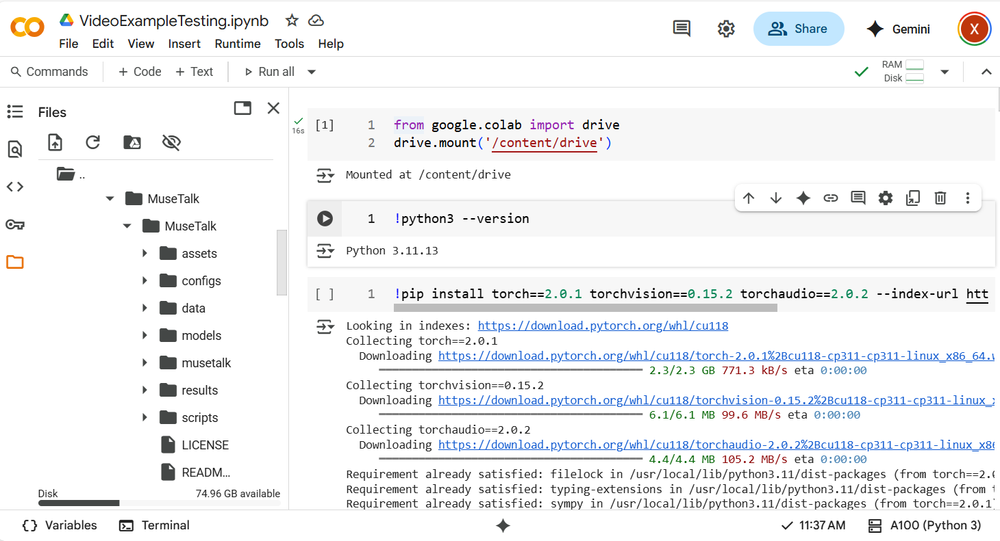

# MuseTalk-Colab_Implementation

Here we provided ***a google colab implementation*** of MuseTalk.

---
## Description

MuseTalk is an AI framework for real-time video dubbing that synchronizes lip movements to new audio while preserving facial identity and visual quality. By leveraging a two-stage GAN-based architecture in the latent space of a pretrained VAE, MuseTalk introduces spatio-temporal sampling strategies—temporal frame alignment and spatially focused mouth region enhancement—to boost lip-sync accuracy and visual realism. 

---
## Examples

### Case 1: Text + Orignal Video to Video

<table class="center">
<tr>
    <td width=30% style="border: none">
        Input 1
    </td>
    <td width=35% style="border: none">
        Input 2 (Original)
    </td>
    <td width=35% style="border: none">
        Output
    </td>
</tr>

<tr>
    <td width=30% style="border: none">
       Large language model is gradually changing people's lives...
    </td>
    <td width=35% style="border: none">
        <video controls loop src="https://github.com/user-attachments/assets/236c1c11-fb19-468a-a60b-02f0689783c1" muted="false"></video>
    </td>
    <td width=35% style="border: none">
        <video controls loop src="https://github.com/user-attachments/assets/c384d17b-3236-4a05-b1a6-0100e140841a" muted="false"></video>
    </td>
</tr>
</table>

> ***Note***: text to audio, please see https://github.com/xinxingwu-uk/OpenVoice 

### Case 2: Audio + Orignal Video to Video
<table class="center">
<tr>
    <td width=30% style="border: none">
        Input 1
    </td>
    <td width=35% style="border: none">
        Input 2 (Original)
    </td>
    <td width=35% style="border: none">
        Output
    </td>
</tr>

<tr>
    <td width=30% style="border: none">
       
    </td>
    <td width=35% style="border: none">
        <video controls loop src="https://github.com/user-attachments/assets/38afbcb5-575c-4e05-bc63-71977a314cb0" muted="false"></video>
    </td>
    <td width=35% style="border: none">
        <video controls loop src="https://github.com/user-attachments/assets/884209d9-93f9-4a37-9e10-b471a06d4e83" muted="false"></video>
    </td>
</tr>
</table>

### Case 3: Audio + Orignal Video to Video
<table class="center">
<tr>
    <td width=30% style="border: none">
        Input 1
    </td>
    <td width=35% style="border: none">
        Input 2 (Original)
    </td>
    <td width=35% style="border: none">
        Output
    </td>
</tr>

<tr>
    <td width=30% style="border: none">
       
    </td>
    <td width=35% style="border: none">
        <video controls loop src="https://github.com/user-attachments/assets/f3051dc1-68a6-4814-b4da-c92ad579e0b1" muted="false"></video>
    </td>
    <td width=35% style="border: none">
        <video controls loop src="https://github.com/user-attachments/assets/8086b66f-d201-43e5-b40a-df15e7a57ef5" muted="false"></video>
    </td>
</tr>
</table>

> ***Note 1***: We have observed that the model performs suboptimally when tested on animation videos. This is likely because the underlying model was primarily trained on real, human-centric datasets. As a result, its ability to generalize to animation videos is limited, and the outputs in these cases may be less accurate or realistic.

> ***Note 2*** (used A100GPU in Colab): Audio + Orignal Video to Video - Generating a 3-minute 54-second video takes approximately 5 minutes and 5 seconds. In comparison, generating an 18-second video requires about 2 minute and 5 seconds.

---
## 🔥 Procedures - Implementation in Colab

Setting in Colab: In the implementation, used A100GPU in Colab as follows

---

* ***Step 1***: Download the ipynb file https://github.com/xinxingwu-uk/MuseTalk-Colab_Implementation/blob/main/DownloadModel.ipynb from the GitHub repository, then upload it to your Google Drive.

* ***Step 2***: In Google Drive, open the ipynb file by Google Colab

* ***Step 3***: Implement the ipynb file in Google Colab - Run all cells in the notebook to set up and download the project.

  

* ***Step 4***: After execution, check your Google Drive in the same folder where the notebook is located. The whole project should now be available there - Google Drive folder: HeyGem-Linux-Python-Hack.

* ***Step 5***: Upload the ipynb files VideoExampleTesting.ipynb https://github.com/xinxingwu-uk/MuseTalk-Colab_Implementation/blob/main/VideoExampleTesting.ipynb in your Google Drive, right-click, and open with Google Colab. Then, run through the notebook step by step:

> (a) Find the uploaded VideoExampleTesting.ipynb, open it

> (b) Mount Google Drive

> (c) Execute all cells in order for VideoExampleTesting.ipynb. After completing implementation:

The results saved to ./results/test/v15/wu_wu.mp4

---
>***Note***: All related materials, including notebooks, models, and output files, are provided in the [Google Drive](https://drive.google.com/drive/folders/1ZePnw7IOCg8R-0JyfGYf7ptPdyJhNb_Y?usp=sharing)

---
## Acknowledgements

This project is based on [Original Project](https://github.com/xinxingwu-uk/MuseTalk/tree/main) licensed under the MIT License.

See [LICENSE](https://github.com/xinxingwu-uk/MuseTalk-Colab_Implementation/blob/main/LICENSE) for details.
